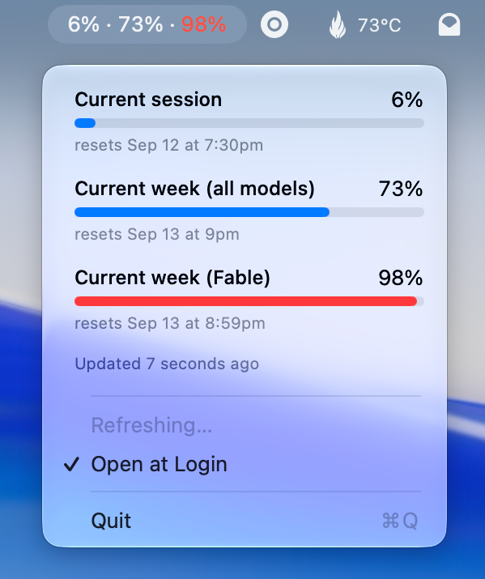

# Claude Usage

A macOS menu bar app that shows your Claude subscription usage limits (current session, current
week, and per-model week) as `6% · 73% · 98%`. It gets the numbers by running Claude Code's own
`claude -p "/usage"`, so it needs no API token.



Requirements: macOS 14+, Xcode (only its toolchain is used), and Claude Code installed and logged in.
`claude` needs to be findable either via the login shell's PATH (`zsh -lc`, i.e. `.zshenv`,
`.zprofile` or `.zlogin` — note `.zshrc` is not sourced) or in `~/.local/bin`, `/opt/homebrew/bin`
or `/usr/local/bin`. The app enables "Open at login" automatically on first launch.

```bash
./build.sh install   # build, copy to /Applications, launch
./build.sh           # build only → build/Claude Usage.app
./test.sh            # run the tests
CLAUDE_USAGE_E2E=1 ./test.sh --filter realClaudeEndToEnd   # check against the real claude
```

If the menu keeps saying "Claude Code didn't return your limits", check whether
`CLAUDE_CODE_DISABLE_NONESSENTIAL_TRAFFIC` is set, in your environment or in the `env` block of
`~/.claude/settings.json`. It makes `/usage` skip fetching your limits. If you only set it to opt out
of telemetry, `DISABLE_TELEMETRY=1` does that without breaking this app.

Design: `docs/superpowers/specs/2026-09-11-claude-usage-menubar-design.md`

License: [MIT](LICENSE)
